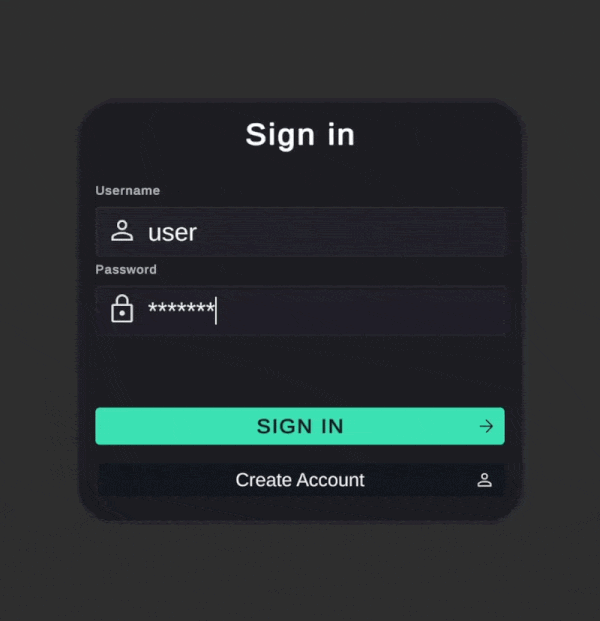
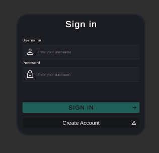

# LockIn Backend API

Backend API for a long-session productivity tracking application built for a Unity client.
The project focuses on session consistency, run tracking, and cross-platform synchronization between desktop and mobile clients.

Unlike traditional Pomodoro timers, this system is designed around uninterrupted focus sessions and flexible long-term tracking. Runs can last from a single session to multiple days depending on the user's workflow.

The backend is designed to work with a [Unity client application](https://github.com/S0dya/TimerApp)



---

# Overview

The backend handles:

* authentication
* timer settings
* active session tracking
* run lifecycle management
* history persistence
* synchronization between multiple devices

---

# Tech Stack

* **ASP.NET Core 10** 
* **PostgreSQL** 
* **Entity Framework Core** 
* **JWT Authentication** 
* **BCrypt** 
* **Swagger** 

---

# Core Application Logic

## Authentication

The authentication layer uses JWT tokens with username/password authorization.

The system avoids email verification to keep the registration flow lightweight while still supporting multi-device synchronization

### Auth Features

* registration
* login
* JWT token generation
* protected endpoints
* role support



---

## Runs & Sessions

A run represents long-term focus tracking and contains:

* session configuration
* progress data
* timestamps
* completion state

A session represents uninterrupted focus time of specific duration and can not be paused.

### Run Lifecycle

A user:

1. starts a session, which can start the current run
2. completes or cancels it
3. continues building progress
4. submits or cancels the run

Submitted runs are stored in history.


Unlike traditional Pomodoro systems:

* runs are not tied to a day
* runs do not reset at midnight
* runs can exceed planned sessions


---

## Timer Settings

Timer settings are separated from the active run.

A user can modify:

* session duration
* planned session amount

while an active run is already running.

New settings are only applied to the not started run.
This prevents runtime manipulation of active sessions and keeps tracking data consistent.

### Settings Features

* automatic default settings creation
* configurable limits
* server-side validation
* persistent user settings


---

# Architecture Decisions

## Service Separation

Controllers handle HTTP, services handle business logic, DTOs separate API contracts from persistence models.

```csharp
// Controller - thin HTTP layer
[HttpPost("login")]
public async Task<ActionResult<AuthResponse>> Login([FromBody]LoginRequest request)
{
    var response = await _authService.Login(request);
    return Ok(response);
}

// Service - business logic
public async Task<AuthResponse> Login(LoginRequest request)
{
    _passwordValidation.ValidatePassword(request.Password);
    var existingUser = await _db.Users.FirstOrDefaultAsync(user => user.Username == request.Username);
    // ...
}
```

---

## JWT Token Generation

JWT tokens contain user claims for stateless authentication.

```csharp
var claims = new[]
{
    new Claim(ClaimTypes.NameIdentifier, user.Id.ToString()),
    new Claim(ClaimTypes.Name, user.Username),
    new Claim(ClaimTypes.Role, user.UserRole.ToString()),
};

var token = new JwtSecurityToken(
    issuer: _jwtOptions.Issuer,
    audience: _jwtOptions.Audience,
    claims: claims,
    expires: DateTime.UtcNow.AddMinutes(_jwtOptions.ExpirationMinutes),
    signingCredentials: credentials
);
```

---

## Current User Service

Extract user context from JWT claims via dependency injection instead of passing userId through methods.

```csharp
public class CurrentUser : ICurrentUser
{
    public Guid UserId
    {
        get
        {
            var claim = _accessor.HttpContext?.User.FindFirst(ClaimTypes.NameIdentifier)?.Value;
            if (claim == null) throw new UnauthorizedAccessException("UserId is not authenticated");
            return Guid.Parse(claim);
        }
    }
}

// Usage in controller
public async Task<ActionResult<SessionStartResponse>> StartSession()
{
    var response = await _runService.StartSession(_currentUser.UserId);
    return Ok(response);
}
```

---

## Database Constraint for Active Runs

Unique filtered index prevents multiple active runs per user at the database level.

```csharp
modelBuilder.Entity<RunEntity>()
    .HasIndex(run => run.UserId)
    .HasFilter("\"RunEndTime\" IS NULL")
    .IsUnique();
```

---

## Settings Isolation

Timer settings are snapshot at run creation, preventing runtime changes from affecting active sessions.

```csharp
private async Task<RunEntity> CreateNewRun(Guid userId)
{
    var settings = await _settingsService.GetTimerSettings(userId);

    return new RunEntity()
    {
        SessionDuration = settings.SessionDuration,
        PlannedSessionsAmount = settings.SessionsAmount,
        // Settings snapshot, not reference
    };
}
```

---

## Server-Side Session Validation

Prevent instant session completion while allowing timing tolerance for network latency and mobile delays.

```csharp
var elapsed = DateTime.UtcNow - currentRun.CurrentSessionStartTime.Value;
var expected = TimeSpan.FromSeconds(currentRun.SessionDuration);

if (elapsed < expected - TimeSpan.FromSeconds(_timerOptions.SessionStopTimerDifferenceOffset))
{
    throw new BusinessException("Session duration is out of time difference offset");
}
```

---

## Database Optimization

Read-only history queries use `AsNoTracking()` to avoid change tracking overhead.

```csharp
var runEntities = await _dbContext.RunEntities
    .AsNoTracking()
    .Where(x => x.UserId == userId && !x.IsCancelled && x.RunEndTime != null)
    .OrderByDescending(r => r.RunEndTime)
    .Skip(request.Offset)
    .Take(request.Limit)
    .ToListAsync();
```

---

## Global Exception Middleware

Centralized error handling with structured logging and consistent error responses.

```csharp
public async Task InvokeAsync(HttpContext context)
{
    var traceId = context.TraceIdentifier;

    try
    {
        await _next(context);
    }
    catch (BusinessException ex)
    {
        _logger.LogInformation(ex, "Business exception occurred");
        await HandleExceptionAsync(context, HttpStatusCode.BadRequest, ex.Message);
    }
    catch (Exception ex)
    {
        _logger.LogError(ex, "Unhandled exception occurred");
        await HandleExceptionAsync(context, HttpStatusCode.InternalServerError, "Internal server error");
    }
}
```

---

## Configuration Validation

Clamp user settings to valid ranges instead of rejecting.

```csharp
var clampedDuration = Math.Clamp(request.SessionDuration, _options.MinDuration, _options.MaxDuration);
var clampedAmount = Math.Clamp(request.SessionsAmount, _options.MinAmount, _options.MaxAmount);
```

---

# API Endpoints

## Authentication

| Method | Endpoint                 |
| ------ | ------------------------ |
| POST   | `/auth/register`         |
| POST   | `/auth/login`            |
| GET    | `/auth/get-current-user` |

## Timer

| Method | Endpoint                     |
| ------ | ---------------------------- |
| POST   | `/timer/run/start-session`   |
| POST   | `/timer/run/finish-session`  |
| POST   | `/timer/run/cancel-session`  |
| POST   | `/timer/run/finish-run`      |
| POST   | `/timer/run/cancel-run`      |
| GET    | `/timer/run/get-current-run` |
| GET    | `/timer/run/get-run-history` |

## Health

| Method | Endpoint  |
| ------ | --------- |
| GET    | `/health` |


---

# Database

## Main Entities

### Users

Stores authentication and account information.

### TimerSettings

Stores user-specific session configuration.

### Runs

Stores:

* progress
* timestamps
* completion state
* descriptions
* session metrics

---

# Technical Challenges Solved

## Active Session Synchronization

Ensuring frontend state remains synchronized with backend session state after:

* reconnects
* app restarts
* cross-device usage

## Concurrent Run Prevention

Preventing multiple active runs from existing simultaneously.

## Session Integrity

Preventing instant session completion while still supporting small timing offsets.

---
